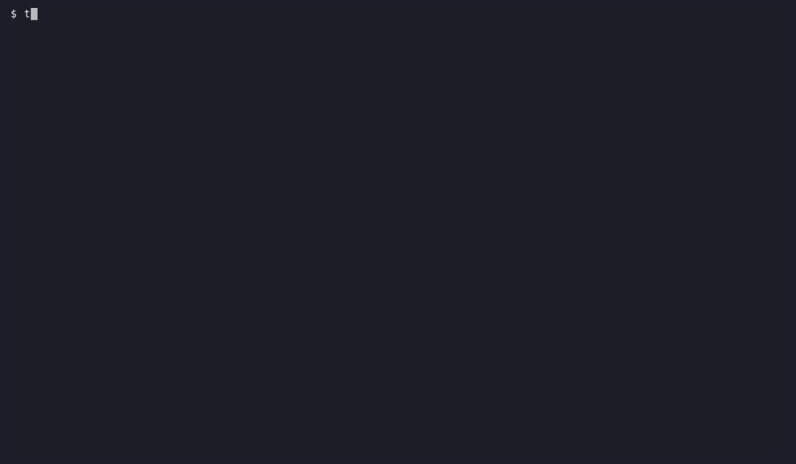

# 🐳 termdock

[](https://github.com/padovanl/termdock/actions/workflows/ci.yml)
[](https://github.com/padovanl/termdock/actions/workflows/release.yml)
[](https://github.com/padovanl/termdock/releases/latest)
[](https://github.com/padovanl/termdock/releases)
[](go.mod)
[](LICENSE)

**[padovanl.github.io/termdock](https://padovanl.github.io/termdock/)**

A terminal multiplexer in the tmux/screen tradition — split your terminal
into panes, run multiple shells side by side, and keep everything running
in the background so you can detach and reattach later, even from a
different machine, without losing a thing.



Written from scratch in Go, with **no dependency on tmux or screen**: it
manages pseudo-terminals (ptys) and its own VT100 emulator (with
scrollback) for every pane directly.

It also does a handful of things tmux doesn't, by default, at all — 🔍 a
fuzzy jump picker, 🖼️ a live pane overview, 🔎 search across every pane's
scrollback at once, 🔄 session switching without detaching, 🪟 a floating
popup terminal, 🔗 a link/path picker, 🔔 background activity notification,
📝 built-in pane logging, and 💾 crash/reboot recovery among them. See
[✨ What makes it different](#-what-makes-it-different-from-tmux).

## ✨ What makes it different from tmux

| | termdock | tmux |
|---|---|---|
| 🔍 **Jump to a window/pane** | one type-ahead, fuzzy-filtered list of every pane, ranked most-recently-used | separate `choose-window` / `choose-pane`, paged with j/k, no fuzzy filter |
| 🖼️ **See every pane at once** | a live-thumbnail grid overview (`Ctrl-B g`) | no equivalent — one pane at a time |
| 🔎 **Search the scrollback** | one search across *every* pane in *every* window | copy-mode `/` only ever searches the one pane you're already in |
| 🔄 **Switch sessions** | fuzzy-picker, no detach required (`Ctrl-B S`) | detach and reattach, or `choose-tree` |
| 👀 **Screen-share / pair** | a real read-only attach mode (`termdock attach -r`) | everyone who attaches can type |
| 📋 **Paste history** | a fuzzy picker over your last 20 yanks (`Ctrl-B =`) | `choose-buffer`, same idea, no fuzzy filter |
| 🖱️ **Select text** | click-drag on any pane, anywhere, any time | needs `mouse on` + drag-to-select behavior varies by config |
| 🖱️ **Reorder/move things** | drag a window tab to reorder it, drag a pane's title onto a tab to relocate it | `swap-window`/`join-pane`, typed out by index |
| 💾 **Survive a crash or reboot** | automatic — layout + working directories snapshotted continuously, restored on next launch | tmux needs the external `tmux-resurrect` plugin |
| 🔢 **Pane/window numbering** | always a clean, positional `1, 2, 3…` | numbers can leave gaps after closing one, unless `renumber-windows` is set |
| ❓ **Keybinding help** | a real scrollable screen | crammed into (and clipped by) the status line |
| ⚠️ **Closing a whole window** | asks `y`/`n` first | gone immediately, no confirmation |
| 🖼️ **Panel borders** | always-on, junction-aware box drawing with the active pane highlighted | thin borders, style is you-configure-it |
| 🎯 **Zoom feedback** | the zoomed pane's border turns magenta and gets a `[Z]` tag | no visual cue you're zoomed beyond the layout itself |
| 🪟 **Scratch terminal** | a floating popup pane (`Ctrl-B P`) toggled over whatever you're doing, no layout change | tmux needs a dedicated popup session and a scripted `display-popup` binding |
| 🔗 **Open a URL/path** | fuzzy-pick any link or path visible on screen, copied straight to your clipboard (`Ctrl-B u`) | tmux needs the external `tmux-open`/`tmux-fpp` plugins |
| 🔔 **Background activity** | one real terminal bell (`\a`) the moment a background window's `*` first lights up, not per line | tmux's `monitor-activity`/`visual-activity` needs both set explicitly |
| ✂️ **Break a pane out** | `Ctrl-B !` moves the active pane into its own new window | tmux's `break-pane`, same idea, same key |
| 📊 **Status bar segments** | opt-in git branch / battery segments, no extra process | tmux needs `#()` shell hooks in `status-right` |
| 🔢 **Jump to a pane by number** | `Ctrl-B Q` badges every pane with a digit, press it to jump | tmux's `display-panes`, same idea, `Ctrl-B q` (termdock's `q` already means quit) |
| 💻 **Command prompt** | `Ctrl-B :` runs the same verbs as the scripting CLI, no target needed | tmux's `command-prompt`, same key, but needs an explicit target most of the time |
| 🧱 **Preset layouts** | `Ctrl-B Space` cycles tiled / even-columns / even-rows | tmux's `next-layout`, same key, same idea |
| 🔁 **Respawn a pane** | `Ctrl-B R` restarts the shell in place, no confirmation needed (same as `x`) | tmux's `respawn-pane` has no default binding and needs `-k` to force a live pane |
| 📝 **Log a pane to a file** | `Ctrl-B L` toggles it, no path to type, `[REC]` on the title | tmux needs the external tmux-logging plugin, or a hand-written `pipe-pane` |
| 🎨 **Ready-made color themes** | built in — 11 of them, colouring the pane backgrounds too, not just the status bar, one `theme <name>` config line (Dracula, Nord, Gruvbox, Catppuccin, Solarized, Tokyo Night, Ubuntu, Monokai, One Dark, Everforest, Rosé Pine), no plugin | tmux needs the external tmux-themepack or a per-theme plugin |
| ⏮️ **Toggle the last window** | `Ctrl-B W` flips back to whichever window you were just on | `Ctrl-B l`, same idea (termdock's own `l` is pane-left, vim-style) |
| ⏮️ **Toggle the last pane** | `Ctrl-B ;` flips back to whichever pane you were just on in this window | `Ctrl-B ;`, same key, same idea |
| 📈 **CPU / memory segments** | built in, read straight from `/proc`, no subprocess | tmux needs the external `tmux-cpu`/`tmux-mem-cpu-load` plugins |
| 📏 **Line-wise copy selection** | `V` in copy-mode selects whole lines, `v` switches back without losing the selection | tmux's own copy-mode line-selection, same `V`/`v` idea |
| 🪟 **Popup running a specific tool** | `popup-command lazygit` in the config — no scripted binding needed | tmux needs a scripted `bind ... display-popup -E lazygit` |
| ⌨️ **Rebind a keybinding** | one `bind <key> <action>` config line, e.g. `bind M jump-picker` | tmux's own `bind-key`, same idea |
| 🎯 **Pane focus events** | `focus-events on` forwards synthetic focus-in/out on every pane/window switch | tmux's own `focus-events`, same idea (plus real OS-level focus tmux also forwards — see [🚧 What's missing](#-whats-missing-on-purpose-for-now)) |
| ➡️ **Move pane focus from a script** | `termdock select-pane -t TARGET -L/-R/-U/-D`, no client attached | tmux's own `select-pane -L/-R/-U/-D` |
| ⚠️ **Quitting the whole session** | `Ctrl-B q` asks `y`/`n` first — closing every window and pane at once deserves the same care `&` already gets | gone immediately, no confirmation |
| 🏷️ **Rename a live session** | `Ctrl-B $` renames it for real: the unix socket and the recovery snapshot move too, so `ls`/`attach -t` follow immediately | tmux's own `rename-session`, same key |
| ⏩ **Repeating a focus move** | after `Ctrl-B ←`, a bare `←` keeps moving — and only the *arrows* repeat, so it can never swallow the `h` of something you start typing | tmux's `bind -r`, but its repeatable movement keys are `hjkl` too, which does eat typed letters |
| ↩️ **Reopen a closed pane** | `Ctrl-B Z` brings back the last pane you closed — same window, same working directory, however you closed it (`x`, or an accidental `exit`) | no equivalent: a closed pane is gone |
| ⏳ **"Tell me when this finishes"** | `Ctrl-B m` marks a pane; the moment its command exits you get a bell and a message naming it. No shell setup, and it can be armed *after* the command is already running | `monitor-silence` watches for output going quiet: it fires on a build that pauses to think, and stays silent on one that ends without a final line |
| 🧠 **Knows where your commands are** | `termdock shell-init` teaches your shell to mark prompts (OSC 133), which termdock records in its own VT emulator: `{`/`}` jump between commands, `Ctrl-B O` copies one command's *entire* output exactly, and a pane whose last command failed shows its exit status and how long it took | no equivalent, and no way to add one — tmux sees an undifferentiated stream of characters and has no emulator of its own to record marks in |
| 🕮 **Session-wide command history** | `Ctrl-B H` fuzzy-searches every command run in *any* pane of the session, showing how each one exited and how long it took; Enter types it back into the current pane | your shell's history only, which is per-pane, records what you typed but not what happened, and isn't written until that shell exits |
| 📡 **Type into several panes at once** | `Ctrl-B y` syncs the whole window, or pick exactly which panes in the overview with `space` — the status bar then reads `[SYNC 3/7]` | `synchronize-panes` is all-or-nothing over a window: the pane you need to *keep* out of it has to be moved elsewhere first |
| 🔎 **Regex search** | copy-mode `/` and global search both accept a regex (falls back to a literal substring if it doesn't compile) | copy-mode search is a plain substring only |

Every "tmux needs the external `tmux-whatever` plugin" above is describing **tmux**, not termdock: everything in the termdock column is built into the single `termdock` binary. There's no plugin manager, no plugin API, and nothing here — themes, status segments, logging, the popup, any of it — ever needs an external plugin, script, or program to work. The one narrow exception is the `git` status segment, which shells out to your system's own `git` binary the same way any git integration would (not a termdock plugin, just using the tool that's already there) — everything else is pure Go, self-contained.

## 🏗️ Architecture

`termdock` is split into a **server** and a **client**, like tmux:

- The **server** is a daemon process, detached from the terminal, that
  actually owns the panes (the shells, their ptys, the terminal emulator).
  It stays alive until you explicitly kill it, independent of any
  attached client.
- The **client** is what you see: it connects to the server over a unix
  socket, draws the screen, and forwards keys/mouse input. Closing it (or
  detaching with `Ctrl-B d`, or losing the connection) doesn't touch the
  panes: they stay alive on the server, ready for a new attach.

This is what makes detach/reattach possible.

## 📦 Installation

Every [release](https://github.com/padovanl/termdock/releases/latest)
ships native packages and archives for linux and macOS, amd64 and arm64.
Pick the one for your system — the version is in the filename, so copy
the exact link from the release page.

```sh
# Debian / Ubuntu
sudo apt install ./termdock_<version>_linux_amd64.deb

# Fedora / RHEL
sudo dnf install ./termdock_<version>_linux_amd64.rpm

# Alpine
sudo apk add --allow-untrusted ./termdock_<version>_linux_amd64.apk

# anything else: unpack the tar.gz and put the binary on your $PATH
tar xf termdock_<version>_linux_amd64.tar.gz && sudo install termdock /usr/local/bin/

# or build it yourself, with Go installed
go install github.com/padovanl/termdock@latest
```

`termdock --version` reports exactly which build you're running.

The packages install the binary to `/usr/bin/termdock` and a commented
example config to `/usr/share/doc/termdock/termdock.conf.example`. That
example is documentation, not a config file termdock reads: configuration
is per-user and lives at `~/.config/termdock/termdock.conf`, which
termdock writes for you when you ask it to (see
[⚙️ Configuration](#-configuration)).

## 🔨 Build

```sh
go build -o termdock .
```

Requires the Go version in `go.mod` (or newer) and a POSIX system
(Linux/macOS/WSL).

## 🚀 Usage

```sh
termdock                        # attach to (or create) the default "main" session
termdock new [-s NAME]          # create a new session and attach to it
termdock attach [-t NAME] [-r]  # attach to an existing session; -r = read-only
termdock ls                     # list active sessions
termdock kill-session -t NAME   # terminate a session (and all its panes)
termdock themes                 # list the built-in color themes
termdock shell-init [SHELL]     # print the shell snippet for command marks
```

Sessions survive the terminal closing: you can disconnect over SSH, close
the window, or press `Ctrl-B d`, and find everything exactly as you left
it with a plain `termdock attach`. They survive the *daemon* dying too —
see [💾 Session persistence](#-session-persistence).

### 👀 Read-only observer

`termdock attach -t NAME -r` attaches as a view-only observer: every
frame streams to it exactly like a normal client, but every keystroke and
mouse event it sends is dropped server-side before it ever reaches the
session — it can watch, not touch. Good for screen-sharing or pairing
without handing over control, or for looking in on a long-running job
without any risk of an accidental keypress landing in someone else's
shell. Any number of normal and read-only clients can attach to the same
session at once (that's what makes detach/reattach work in the first
place — the server was already built to broadcast to multiple clients).
An observer's own terminal size never resizes the shared session either,
so a smaller/larger window on their end doesn't disrupt anyone actually
working in it.

## ⌨️ Keys

Every command starts with the **`Ctrl-B` prefix**, followed by a key. Any
other key, when `Ctrl-B` wasn't just pressed, is forwarded straight to the
active pane. Every one of these is the *default* — see
[⌨️ Custom keybindings](#-custom-keybindings) below to rebind any of
them to a different key.

| Key after `Ctrl-B` | Action |
|---|---|
| `v` or `%` | split the active pane **vertically** (side by side) |
| `s` or `"` | split the active pane **horizontally** (stacked) |
| `←/→/↑/↓` or `h/j/k/l` | move focus to the adjacent pane — after an arrow, a **bare** arrow keeps moving without the prefix (see [⏩ Repeating a focus move](#-repeating-a-focus-move)) |
| `o` or `Tab` | cycle to the next pane |
| `z` | 🎯 zoom: the active pane fills the whole screen — its border turns magenta and its title gets a `[Z]` tag, so it's obvious you're zoomed (`z` again to undo) |
| `r` | **resize-mode**: subsequent arrows/hjkl resize the pane, any other key exits |
| `[` | enter **copy-mode** (scroll the scrollback, see below) |
| `]` | paste the most recently copied (yanked) text into the active pane |
| `=` | 📋 **paste register picker**: fuzzy-pick one of your last 20 yanks to paste (see below) |
| `y` | 📡 toggle **sync-panes**: keystrokes go to every pane in this window at once — or to just the ones you pick (see below) |
| `c` | create a new **window** (tab) |
| `n` / `p` | switch to the next / previous window |
| `w` | 🔍 **jump picker**: type to fuzzy-filter every window/pane, ↑↓/Tab to select, Enter to jump (see below) |
| `W` | ⏮️ toggle back to the **previously active window** (see below) |
| `;` | ⏮️ toggle back to the **previously active pane** in this window (see below) |
| `g` | 🖼️ **overview**: a live-thumbnail grid of every pane in the session (see below) |
| `/` | 🔎 **search**: search every pane's scrollback at once (see below) |
| `S` | 🔄 **switch session**: fuzzy-pick another session, no detach needed (see below) |
| `P` | 🪟 toggle a floating **popup terminal** over the current layout (see below) |
| `u` | 🔗 **open picker**: fuzzy-pick a URL/path spotted on screen, copies it to the clipboard (see below) |
| `!` | ✂️ **break-pane**: move the active pane out into its own new window |
| `Q` | 🔢 **quick-jump**: badge every pane with a number, press it to jump there (see below) |
| `:` | 💻 **command prompt**: type a command (`new-window`, `split-window`, ...; see below) |
| `Space` | 🧱 cycle the active window through **preset layouts** (see below) |
| `R` | 🔁 **respawn-pane**: restart the shell in the active pane, in place |
| `Z` | ↩️ **reopen** the last closed pane, back in its window and directory (see below) |
| `m` | ⏳ **notify me** when this pane's command finishes (see below) |
| `O` | 🧠 **copy the last command's entire output** — needs [shell integration](#-shell-integration-termdock-knows-where-your-commands-are) |
| `H` | 🕮 **command history**: fuzzy-search every command run in this session (needs shell integration) |
| `L` | 📝 toggle **logging** the active pane's output to a file (see below) |
| `0`-`9` | jump straight to window N |
| `,` | rename the current window |
| `$` | 🏷️ **rename this session** — the socket and snapshot move with it (see below) |
| `&` | ⚠️ close the current window and every pane in it (asks `y`/`n` first) |
| `C` | ⚙️ **settings**: view and change this session's settings live (see below) |
| `x` | close the active pane |
| `d` | **detach**: disconnect from the session, which keeps running in the background |
| `q` | ⚠️ quit termdock — asks `y`/`n` first (closes the whole session and every window) |
| `?` | ❓ open a scrollable keybinding reference (any key closes it) |
| `Ctrl-B` | double-press: sends a literal `Ctrl-B` to the active pane |

If a shell exits (e.g. with `exit`), its pane closes on its own; when a
window's last pane closes, the window itself closes; once the last window
closes, the session ends.

### 🪟 Windows

Each window is a fully independent set of panes and its own split layout
— like a browser tab, or a tmux window. The status bar shows the window
list on the left as a strip of colored tabs, e.g. ` 0:bash  1:vim!
2:htop* `: the accent color marks the one you're looking at, orange marks
one that produced output while you weren't (`*`/`!` are still there in
the text too, in case colors aren't your thing). Click a tab to switch to
it, the same as a browser tab, and 🖱️ drag a tab sideways to reorder the
strip. A window's name is automatically the foreground command of its
active pane, the same as pane titles, until you rename it with `Ctrl-B
,`. 🖱️ Drag a pane's *title bar* onto a different window's tab to move
that pane there instead — the pane's process is untouched, only which
window's layout it belongs to changes, the same way dragging a browser
tab out into another window doesn't reload the page.

### 🔍 Jump picker

`Ctrl-B w` opens a type-ahead picker listing every pane in every window of
the session — tmux splits this across `choose-window` and `choose-pane`,
each a static list you page through with j/k; termdock's is one list,
fuzzy-filtered as you type (characters just need to appear in order, not
consecutively — `depl` matches `1:deploy`), so getting to a specific pane
in a session with a dozen windows is a few keystrokes instead of hunting
through a list by eye. `↑`/`↓`/`Tab` move the selection, `Enter` jumps
straight to it — switching windows and focusing that exact pane in one
step — `Esc` cancels. The selected entry also gets a live preview box
next to the list — a **minimap** of that pane, the whole thing shrunk
down rather than a crop of one corner, drawn with braille glyphs as a
2×4 pixel grid per cell. A terminal can't shrink its font, so this is
what "the same pane, smaller" actually looks like: you see the shape of
what's in it — where the text sits, how long the lines run, how much has
scrolled — updating live as you move the selection, so you're never
jumping blind. With an empty query
(the moment it opens, or after clearing it) the list is ordered
most-recently-used first instead, so `Ctrl-B w` then `Enter` is a fast
"jump back to whatever I was just looking at," Alt-Tab style.

### ⏮️ Toggling back

`Ctrl-B W` flips back to whichever *window* was active right before the
one you're looking at now — tmux's own `Ctrl-B l`, moved to `W` here
since lowercase `l` is already "move focus right" (the vim-style hjkl
pane navigation above). `Ctrl-B ;` does the same one level down, for the
*pane* you were just on within the current window — tmux's own binding,
same key. Both flip back and forth like Alt-Tab: press again to return
to where you just were. Every deliberate window switch (`n`/`p`, a
number, the jump picker, search, the overview, a new window, break-pane)
updates what `W` jumps back to; every deliberate pane focus change
(`hjkl`/arrows, a click, the jump picker, quick-jump) updates what `;`
jumps back to. Both are simple no-ops if there's nothing recorded yet,
or the window/pane they'd jump to has since closed.

### 🖼️ Pane overview

`Ctrl-B g` replaces the screen with a grid of every pane in every window
of the session, each tile a small live preview of what's actually running
in it — nothing in tmux shows more than one pane's content at a time
outside of actually looking at it. Arrows/hjkl move the selection around
the grid (up/down jump a full row, not just one tile), `Enter` or a click
jumps straight to that pane, `Esc` cancels. Good for "where did I leave
that build running" when you've lost track across a dozen panes.

### 🔎 Search everywhere

`Ctrl-B /` searches every pane's scrollback — history and the live
screen — across every window, all at once. Copy-mode's own `/` (below)
only ever looks inside the one pane you're already in; this is for "did
I see that error somewhere, but I don't remember which pane." Type to
search — case-insensitive, live results as you type, your query tried
as a regex first and falling back to a literal substring if it doesn't
compile as one — `↑`/`↓` move between matches, `Enter` jumps straight to
the exact
matching line — switching to that window/pane and dropping you into
copy-mode with the cursor right on it — `Esc` cancels.

### 🔄 Switching sessions

`Ctrl-B S` opens a fuzzy picker over every *other* active session, so
jumping from one project's session to another doesn't mean detaching
first and reattaching by name — tmux needs `choose-tree` or a manual
detach/reattach round-trip to do the same. Type to filter, `↑`/`↓`
select, `Enter` switches (your terminal reconnects to the other daemon in
place — no flicker, no dropping back to the shell), `Esc` cancels.

### 📋 Paste registers

`Ctrl-B ]` alone always pastes your single most recent copy-mode yank, no
picker involved — unchanged, still the fast path. `Ctrl-B =` (tmux's
`choose-buffer`, same key) opens a fuzzy picker over your last 20 yanks
instead, each shown as a one-line preview, for when the thing you want
isn't the very last thing you copied.

### 🪟 Popup terminal

`Ctrl-B P` toggles a floating scratch terminal centered over whatever
you're currently looking at — 80% wide, 70% tall, no split, no layout
change, no window switch. It's a single persistent pane per session:
toggling it away and back keeps whatever was running (`git log`, a REPL,
a quick `man` page), the same way tmux's own `display-popup -E` does, but
without needing to write the command out every time or wire up a binding
yourself. `Ctrl-B P` again (or `Ctrl-B d`) closes it, clicking outside it
also closes it, and everything else you type goes straight through to the
shell inside it, exactly like a normal pane.

Set `popup-command` in the config (see [⚙️ Configuration](#-configuration))
to run a specific tool there instead of an interactive shell — `lazygit`,
`btop`, `ranger`, whatever you always reach for the popup to open in the
first place — without needing to script a `bind` around
`display-popup -E` the way tmux does. Unlike the default persistent
scratch shell, a `popup-command` popup closes itself the moment that
command exits (quit lazygit, the popup's gone), the same one-shot feel
stock tmux popups already have; toggling it back open runs the command
fresh again.

### 🔗 Opening links and paths

`Ctrl-B u` scans the active pane's visible screen for anything that looks
like a URL or a filesystem path and opens a fuzzy picker over the
matches, most recent (bottom of screen) first — handy after a build spews
a stack trace full of file paths, or `curl` prints a link you want
without reaching for the mouse. `Enter` copies the selected one to your
clipboard via the same OSC52 mechanism copy-mode yanks use (the daemon
may well be running on a different machine over SSH, so it can't just
exec a browser locally); `Esc` cancels. This is what tmux needs the
external `tmux-open`/`tmux-fpp` plugins for.

### 🔔 Background activity

The moment a background window's `*` activity marker first lights up
(see [🪟 Windows](#-windows)), termdock rings your real terminal's bell
(`\a`) once — not once per line, so a chatty background pane doesn't turn
into a siren, and not at all for the window you're already looking at.
What that bell actually *does* — flash the tab, bounce the dock icon,
play a sound — is entirely up to your terminal emulator's own bell
setting, the same as any other program's `\a`. tmux needs both
`monitor-activity` and `visual-activity` set explicitly to get anywhere
close to this.

### ✂️ Breaking a pane out

`Ctrl-B !` (tmux's own `break-pane`, same key) takes the active pane out
of its current split layout and gives it a brand new window all to
itself — the opposite of a split, for when a pane you added to a layout
on a whim turns out to deserve its own window instead. A no-op if it's
already alone in its window.

### 🔢 Quick-jump

`Ctrl-B Q` (tmux's own `display-panes`, moved off `q` since that's
already termdock's quit) badges every pane in the active window with a
number — 1 through 9 — right where its title bar shows it too. Press the
digit to jump straight there, any other key just dismisses the badges
with no effect. Good for a window with enough panes that hunting one
down with `Tab` gets tedious, without needing the full jump picker or
overview for something this local.

### 💻 Command prompt

`Ctrl-B :` (tmux's own binding, same key) opens a typed command line for
the same handful of actions the external scripting CLI exposes
(`new-window`, `split-window`, `select-window`, `rename-window`,
`send-keys`, `kill-pane`, `break-pane`, `respawn-pane`) — without
leaving the session, and without needing a `-t SESSION[:WINDOW]` target,
since a command typed here always means "the window I'm looking at right
now." `new-window` takes `-n NAME`; `split-window` takes `-v`/`-s`
(side-by-side/stacked, same convention as `Ctrl-B v`/`Ctrl-B s`);
`send-keys` takes a trailing `Enter` to submit, same as the CLI version.
Unknown commands or bad arguments show an error in the status line
instead of doing anything. `Esc` cancels without running anything typed
so far.

### 🧱 Preset layouts

`Ctrl-B Space` (tmux's own `next-layout`, same key) rebuilds the active
window's split into the next preset shape — **tiled** (a roughly square
grid), **even-columns**, **even-rows** — cycling back to the first after
the last, always in the panes' current left-to-right/top-to-bottom
order, so it never depends on how the split was originally built by
hand. Every pane's process is left completely alone; only the layout
around it moves, the same guarantee dragging a pane's title onto another
window's tab already gives. A no-op with only one pane, and blocked
while zoomed (exit zoom first) since there'd be nothing to lay out.

### 🔁 Respawning a pane

`Ctrl-B R` (tmux's `respawn-pane`) kills whatever's running in the active
pane and starts a fresh shell in exactly the same spot — same size, same
position in the split, only the process and its underlying pane ID
change. Handy when a shell's wedged, an SSH connection dropped, or a REPL
needs a clean restart, without tearing down and rebuilding the split
around it. Unlike tmux, there's no separate `-k` flag to force it: this
already replaces a still-running process without asking, the same
no-confirmation convention `Ctrl-B x` (close pane) already uses.

### 🧠 Shell integration: termdock knows where your commands are

Every terminal has the same blind spot. It receives one long stream of
characters and has no idea which of them are your prompt, which are the
command you typed, and which are that command's output. It is all just
text arriving.

That is why no multiplexer can offer "jump back to the previous command"
or "copy that command's output" — not because nobody thought of it, but
because the information genuinely isn't there to act on.

**OSC 133** is the fix the terminal world settled on: the shell announces
the boundaries as it goes. Four tiny invisible markers per command —
prompt starts, prompt ends, command started running, command finished
(with its exit status). termdock records them in **its own** VT
emulator, which is why this works over SSH, in any terminal, whether or
not the terminal you're sitting at has ever heard of OSC 133. tmux
cannot do this at any price: it has no emulator of its own to record
them in.

#### Turning it on

One line in your shell's startup file:

```sh
# ~/.bashrc, ~/.zshrc, or ~/.config/fish/config.fish
eval "$(termdock shell-init)"
```

`termdock shell-init` detects your shell from `$SHELL`; pass `bash`,
`zsh` or `fish` explicitly if you'd rather. It **prints** the snippet
instead of installing it — that file is yours and you should read what
goes into it; a program that edits your shell rc behind your back is one
you stop trusting. Run it with no `eval` to just look:

```sh
termdock shell-init bash | less
```

Open a new pane afterwards (existing shells are already running, and
won't pick it up). Nothing about your prompt changes visually — the
markers are zero-width.

> If your prompt is rebuilt by a theme — oh-my-zsh, powerlevel10k,
> starship — put the `eval` line **after** that theme's own setup, or the
> theme will overwrite the marker termdock appends to `PS1`.

#### What you get: a worked example

Say you run a test suite, it fails somewhere in three hundred lines of
output, and you've since run four more commands while poking at it.

```
$ go test ./...          ← 300 lines of output, somewhere up there
$ git status
$ vim internal/core/foo.go
$ git diff
$ go build ./...
$                        ← you are here
```

**Without shell integration**, retrieving that failure means: enter
copy-mode, scroll up by eye past four commands, find where the test run
started, guess where it ended, drag-select several screens of text, and
hope you didn't clip the first line.

**With it:**

| You press | What happens |
|---|---|
| `Ctrl-B [` then `{` | jumps to the prompt of `go build` |
| `{` `{` `{` `{` | four more jumps, one per command, landing on `go test ./...` |
| `Ctrl-B O` | the **entire** output of *that* run — all 300 lines — is on your clipboard |

Three of those keys are the interesting ones:

**`{` and `}` in copy-mode** move by *command*, not by line or page. Each
jump lands on a prompt with that command's output filling the screen
below it — which is the thing you were scrolling to find. Repeated
presses walk back through your history a command at a time.

**`Ctrl-B O`** copies a command's output. Not "roughly this screenful",
not "what's currently visible" — exactly the lines between where that
command started printing and where it stopped, whether that's 2 lines or
3000, with the prompt and the command itself excluded. Paste it straight
into a bug report, a chat, a file.

*Which* command follows where you are looking: in copy-mode it is the
one your cursor is sitting in, so walking back with `{` and then copying
does what it plainly looks like it should. At a live prompt it is the
most recent one. Press it while a build is still running and you get
everything it has printed so far.

**`Ctrl-B H` searches every command you have run**, in any pane of the
session, newest first, with how each one exited and how long it took:

```
go test ./...                            ✗1  2m14s  0:api › 1
kubectl rollout status deploy/web                   1:ops › 2
docker compose up -d                          8s    1:ops › 1
```

Type to filter, Enter **types it into the current pane** without running
it — the list is full of things that already happened, some of which
failed, and firing one straight off a fuzzy match is how the wrong
directory gets deleted. Repeats collapse to one entry.

Your shell's own history cannot be this: it is per-shell, so what you
ran in the pane next door is invisible; it records what you typed but
not what happened, so the command that worked looks identical to the
three attempts before it; and it is written when that shell exits, so a
pane still open has contributed nothing yet.

**Pane titles gain a verdict.** A pane whose last command failed says so:

```
 2:go [✗1 47s]        ← exited 1, took 47 seconds
 3:npm                ← last command succeeded, quickly: nothing added
```

The exit status appears only on failure and the duration only when the
command ran longer than a few seconds — a title is no place for noise,
and `✗` is the thing worth catching out of the corner of your eye when
you glance at a pane you left running.

#### Without it

Nothing breaks. There are simply no marks, and each of the three
features says so and points at the fix rather than silently doing
nothing:

```
no command marks in this pane — run `termdock shell-init` for the shell snippet
```

### ⏳ Telling you when a command finishes

`Ctrl-B m` marks the active pane. The moment whatever it is running
exits and it falls back to a bare prompt, termdock rings the terminal
bell and names the pane in the status bar. An armed pane wears a `[⏳]`
tag on its title, so it is visible rather than something you have to
remember doing; pressing `m` again takes it back. It fires once, then
disarms, so a pane you keep working in doesn't ring on every command.

It is for the twenty-minute build, the test run, the deploy — the jobs
you start and then go and do something else during, which is exactly
when you stop watching a pane you can't see.

Two things make it different from the usual advice of appending
`; notify-send done` to the command. It needs **no shell configuration
at all**: termdock already asks the pty which process group holds the
foreground — the same reading that keeps pane titles current — so
"busy" is just that name not being your shell's, and "finished" is the
transition back. And it can be armed **after** the command is already
running, which a wrapper fundamentally cannot: you almost never know in
advance that this is the run that will take twenty minutes.

tmux has no equivalent. Its `monitor-silence` watches for *output*
going quiet, which is a different thing: it fires on a build that
pauses to think, and stays silent on one that finishes without printing
a final line.

### ↩️ Reopening a closed pane

`Ctrl-B Z` brings back the pane you just closed: a fresh shell, in the
window it came from, started in the directory it was sitting in. Press
it again to walk further back — the last 16 closures are kept.

It covers every way a pane goes away, including a shell that exited on
its own, which is the case it mostly exists for: an `exit` typed into
the wrong pane. Closing a pane is the one destructive thing here that
happens by accident constantly — killing a window and quitting both ask
first — so it is the one worth being able to take back.

What comes back is the *place*, not the process: nothing can resurrect
what was running, the same honest limit
[session persistence](#-session-persistence) has. Retyping the command
is easy; remembering which of four windows it was in and `cd`-ing three
levels down again is what actually costs you. If the reopen can't
happen (no room to split, or the window is zoomed) the pane stays on
the stack, so it is never lost to a failed undo. tmux has no
equivalent: a closed pane is gone.

### 📝 Logging a pane

`Ctrl-B L` toggles capturing the active pane's raw output to a file —
termdock's built-in equivalent of the tmux-logging plugin (or a
hand-written `pipe-pane -o 'cat >>file'`), with no plugin to install and
no path to type. Logs land under
`$XDG_STATE_HOME/termdock/logs/SESSION-wN-pID-TIMESTAMP.log` (falling
back to `~/.local/state/termdock/logs/`), and the status line shows the
exact path the moment logging starts. A pane that's currently logging
gets a `[REC]` tag on its title bar, so it's never a surprise which one
is being captured. Logging follows the pane's *process*, not its spot in
the layout: it survives `Ctrl-B !` (break-pane) moving the pane to a new
window, but a `Ctrl-B R` respawn — which replaces the process outright —
starts the fresh shell with logging off, the same as any other new pane.

### ⌨️ Custom keybindings

Every keybinding in the [⌨️ Keys](#-keys) table above is a *default*,
not a fixed assignment: `bind <key> <action>` in the config (see
[⚙️ Configuration](#-configuration)) reassigns one key to a different
action, e.g. `bind M jump-picker` moves the jump picker from `w` to
`M` (both then trigger it, since `bind` only touches the one key you
name — `w` keeps its old meaning unless you rebind that too). The full
list of action names is in `internal/core/bindings.go`; the help screen
(`Ctrl-B ?`) and the prefix-held cheat-sheet both always reflect
whatever's currently bound, default or rebound, so neither one goes
stale the moment you customize something. Scoped to the top-level
`Ctrl-B`-prefixed commands only — copy-mode's own keys, the popup's, a
picker's type-ahead, and so on aren't rebindable. Arrow keys and `Tab`
are always-available alternates for movement/cycling regardless of any
rebind, the same way they were before this existed.

The digits `0`-`9` are "jump to window N" by default, but an explicit
`bind` on one wins: `bind 5 vsplit` really does make `Ctrl-B 5` split,
at the cost of no longer being able to jump straight to window 5. Only
digits you actually rebind are affected; the rest keep jumping.

### 🏷️ Renaming a session

`Ctrl-B $` (tmux's own key) renames the session you're in, prefilled
with its current name — `Ctrl-U` clears it, `Enter` confirms, `Esc`
cancels. This is a real rename, not just a new label on the status bar:
a session's name *is* the name of its unix socket and of its
crash-recovery snapshot, so both move with it and `termdock ls`,
`termdock attach -t NAME` and the session switcher (`Ctrl-B S`) all
answer to the new name immediately, and stop answering to the old one.
Clients already attached stay attached throughout — they're connected
to the daemon, not to the path.

Renaming onto a name another live session already uses is refused
rather than performed, since that would leave two daemons pointed at
one socket path and whichever lost unreachable.

### ⏩ Repeating a focus move

Walking three panes over shouldn't mean pressing the prefix three times.
After a prefixed arrow moves the focus, a **bare** arrow keeps moving it
for `repeat-time` milliseconds (default 1000, `repeat-time 0` disables) —
so it's `Ctrl-B ←←←`, not `Ctrl-B ← Ctrl-B ← Ctrl-B ←`. Each repeat
extends the window, so a steady walk never expires mid-way, and any
other command (or any other key) ends it immediately, so arrows are
never left hijacked.

This is tmux's `bind -r`/`repeat-time`, with one deliberate difference:
**only the arrow keys repeat, never `hjkl`**. tmux makes its `hjkl`
movement bindings repeatable too, which means a letter you type shortly
after switching panes can be swallowed as a movement instead. Arrows
aren't ordinary text, so restricting the repeat to them removes that
whole failure mode while keeping everything the feature is actually for.

### 🎯 Focus events

`focus-events on` in the config makes termdock forward a synthetic
terminal focus-in/focus-out sequence (`\x1b[I`/`\x1b[O`) to a pane
whenever you switch to/away from it — the same signal a real terminal
sends on Alt-Tab, which apps like neovim's `:checktime`-on-FocusGained
autoread react to, so switching back to a pane running an editor that
was modified elsewhere on disk notices right away. Off by default, same
as tmux's own `focus-events`. This covers termdock's own internal
pane/window switching only, not your terminal emulator itself gaining
or losing OS-level focus — see
[🚧 What's missing](#-whats-missing-on-purpose-for-now).

### ❓ Help

`Ctrl-B ?` opens a scrollable reference listing every keybinding —
`↑`/`↓`/`j`/`k`/`PgUp`/`PgDn`, `Home`/`End` and the mouse wheel scroll it,
any other key closes it. `PgUp`/`PgDn` move by a real screenful, whatever
your terminal's height happens to be. It's the
same floating box the jump picker uses, just without the type-ahead
filter, so a long list stays readable instead of getting crammed into
(and clipped off of) a single status bar line.

### 📋 Copy-mode (scrollback and copying)

Enter with `Ctrl-B [`. From there:

- `h/j/k/l` or arrows: move the cursor; `PgUp`/`PgDn`/`Ctrl-U`/`Ctrl-D`:
  page/half-page; `g`/`G`: top/bottom of the scrollback.
- `v`: start a character-wise selection from the cursor — an exact span,
  the same as click-dragging with the mouse.
- `V`: start a line-wise selection instead — every column of every line
  the selection spans, ignoring where exactly the cursor sits on the
  first/last one, vim's own visual-line mode. Good for grabbing a clean
  block of log lines without chasing column alignment. Pressing `v`
  while a `V` selection is active (or `V` while a `v` one is) switches
  modes in place, keeping the selection you already have, the same way
  vim's own `v`/`V` do inside visual mode; pressing the *same* key again
  exits the selection instead.
- `y` or `Enter`: copy the selection and exit copy-mode. The copied text
  is pushed to the real terminal via **OSC52**, so it lands in the system
  clipboard on terminals that support it (essentially every modern one:
  iTerm2, Windows Terminal, kitty, WezTerm, recent gnome-terminal...).
- `/`: search the scrollback (type the text, `Enter` jumps to the closest
  match searching forward). `n` / `N` repeat the last search forward /
  backward. Case-insensitive; your query is tried as a regular
  expression first (`err(or)?-\d+` works) and only falls back to a
  literal substring match if it doesn't compile as one — same as the
  global search below.
- `q` or `Esc`: exit without copying.

### 🖱️ Mouse

- Click a pane: gives it focus.
- Click-drag on a pane's content: selects text and copies it on release —
  no need to enter copy-mode first, the same as any ordinary terminal.
  Releasing also *leaves* copy-mode, exactly like pressing `y`, so the
  pane goes straight back to taking your typing. The status bar confirms
  what was copied. (A plain click with no drag still just focuses the
  pane; a drag over blank space copies nothing and leaves your clipboard
  alone.)
- Double-click a pane's title bar: 🎯 zooms it (same as `Ctrl-B z`);
  double-click again to unzoom.
- Drag a pane's title bar onto a different window's tab: moves that pane
  into that window (see [🪟 Windows](#-windows)).
- Drag the border between two panes, side by side or stacked: resizes
  them.
- Click a window tab in the status bar: switches to it. Drag it sideways
  to reorder the tab strip, the same as dragging a browser tab.
- Wheel: if the pane has scrollback, automatically enters copy-mode and
  scrolls; scrolling back to the bottom exits it automatically.
- Drag in copy-mode: selects text and copies it on release.

### 🎨 Pane titles and borders

Every pane is framed by a thin border, with its title embedded in the top
edge (e.g. `2:vim`) — the number is the pane's position within its window
(left-to-right, top-to-bottom), not an internal id, so it stays small and
predictable as you split and close panes. The title shows the foreground
command, not just the shell name, so you can tell what's running where at
a glance. (Linux only; elsewhere it always shows the shell name.) The
active pane's border is drawn in the accent color (`pane-active-bg`
below) so it's obvious which pane has focus. Every border, junction, and
corner is auto-tiled from the actual pane layout — there's no such thing
as a two-pane seam that doesn't line up.

### 📊 Status bar

The left side is minimal at rest (`Ctrl-B ?`) so there's room for the
right side: hostname and clock, tmux-style. Press the prefix and the left
side expands to the full key list for as long as you're mid-command;
`Ctrl-B ?` opens the same list as a proper scrollable screen instead (see
[❓ Help](#-help)), for when you want to actually read it rather than
catch it in passing. Turn on `status-segments` in the config (see
[⚙️ Configuration](#-configuration)) to prepend a git branch and/or
battery reading to the right side too, computed with a short cache so
they don't add overhead to every frame.

## 📜 Scripting a session

Beyond the interactive keys, termdock has a small command-line interface
for driving a session from outside — a setup script that opens a project
in a few pre-arranged windows, a Makefile target that tails a log in a
split pane, anything you'd otherwise have to click through by hand. This
is what `tmux send-keys`/`new-window`/`split-window`/... are for tmux.

`TARGET` is `SESSION[:WINDOW[.PANE]]` — e.g. `main`, `main:1`, `main:1.2`.
`WINDOW` is either its index (the number in the status bar's tab strip) or
its name; `PANE` is the number shown in that pane's own title bar, which is
also the `INDEX` column of `list-panes`. Omitting `WINDOW` means "the active
window"; omitting `PANE` means "that window's active pane". `select-pane`
and `list-panes` act on a whole window, so they ignore a `.PANE` part.

```sh
termdock send-keys -t TARGET text... [Enter]     # type text into a pane; trailing "Enter" submits it
termdock new-window -t SESSION [-n NAME] [cmd...] # new window, optionally running cmd instead of the shell
termdock split-window -t TARGET [-v|-s] [cmd...]  # -v side by side (default), -s stacked
termdock select-window -t SESSION:WINDOW          # make a window the visible one
termdock select-pane -t TARGET -L|-R|-U|-D        # move that window's focus one pane in a direction
termdock list-windows -t SESSION
termdock list-panes -t SESSION[:WINDOW]
```

```sh
# example: set up a 3-pane dev environment in one shot
termdock new-window -t main -n dev
termdock split-window -t main:dev -s 'npm run dev'
termdock split-window -t main:dev.1 -v 'npm test -- --watch'
termdock select-window -t main:dev
```

These commands work whether or not anyone is currently attached to the
session — they talk straight to the daemon over its socket, the same way
`termdock ls`/`kill-session` do, and don't require (or start) a client.
`select-pane` in particular is the piece external tooling needs to move
focus by direction without an interactive client attached at all — the
building block a vim-tmux-navigator-style integration (seamless `hjkl`
between vim splits and termdock panes) would call into, the same way it
calls tmux's own `select-pane -L/-R/-U/-D` today.

### 📐 Small terminals

The layout degrades gracefully instead of breaking, the same way tmux
keeps shrinking panes rather than refusing to redraw: panes shrink
proportionally down to zero size if there truly isn't room, the outer
border/margin around the whole pane area is dropped first to give a very
small terminal every last row and column of real content, and the status
bar is the first thing to go on a single-row terminal. Nothing crashes at
any size; existing splits just get harder to see the smaller you go,
exactly like a real multiplexer.

### 💾 Session persistence

A tmux session doesn't survive the server crashing or the machine
rebooting on its own — that's what plugins like tmux-resurrect are for.
termdock does this natively: every structural change (split, close,
rename, move) — and, in the background, every 30s besides, to catch a
pane's plain `cd` drifting where a structural-change-only save wouldn't
notice — writes a snapshot of the session's window/pane layout and each
pane's working directory to
`$XDG_STATE_HOME/termdock/SESSION.json` (falling back to
`~/.local/state/termdock/`). If the daemon for a session with that name
isn't already running when you `termdock new` it, and a snapshot exists,
it's restored: the same split layout and window names, a fresh shell
relaunched in each pane's last known directory. What's running inside
each pane (a build mid-compile, a REPL, `vim`'s undo history) is *not*
recovered — nothing can resurrect actual process state after a crash,
only put you back where you were about to be. A session that ends on
purpose (`Ctrl-B q`, its last pane exiting normally, `termdock
kill-session`) deletes its own snapshot on the way out, so it doesn't
resurrect itself the next time that name is reused; only an unclean end
leaves one behind to recover from.

## ⚙️ Configuration

Optional config file at `$XDG_CONFIG_HOME/termdock/termdock.conf`
(falling back to `~/.config/termdock/termdock.conf`), or wherever
`$TERMDOCK_CONFIG` points. Plain `key value` lines, `#` for comments — no
command language, unlike tmux.conf. Everything is optional; a missing
file just means the defaults below.

You don't have to edit the file and restart, though: **`Ctrl-B C` opens a
settings screen** listing every setting with its current value, and
everything in it can be changed on a live session — see
[⚙️ Changing settings while it runs](#-changing-settings-while-it-runs).

```conf
# termdock.conf
prefix C-a             # prefix key, any Ctrl+letter (default C-b)
mouse on                # enable mouse support (default on)
history-limit 10000     # scrollback lines kept per pane (default 10000)
shell /bin/zsh           # shell for new panes (default $SHELL)
popup-command lazygit    # what Ctrl-B P runs (default: the shell, see below)
focus-events on          # forward synthetic pane focus-in/out (default off)
repeat-time 1000         # ms a bare arrow keeps moving focus (default 1000, 0 off)
bind M jump-picker        # rebind one key to a different action (repeatable)
theme dracula            # bundled color preset (default: none, see below)
status-bg black          # status bar background (default black)
status-fg silver         # status bar foreground (default silver)
pane-active-bg teal       # active pane's border/title color (default teal)
pane-bg default          # background behind unstyled pane content (default: your terminal's)
pane-fg default          # foreground for unstyled pane content (default: your terminal's)
status-segments git,battery,cpu,mem  # extra segments in the status bar (default: none)
```

Colors accept any W3C name tcell understands, or `#rrggbb` hex. A `#`
starts a comment, on a line of its own or after a setting's value as
above — with the one exception that a setting's *first* value word is
taken literally, so `status-bg #ff0000` still means the color.
`prefix`/`history-limit`/`shell`/`popup-command`/`focus-events`/`bind`/
`repeat-time`
are read by the **server**, so they take effect when a session is
*created* (`termdock new`), not on every attach; `mouse`, `theme`, and
the colors are read by the **client**, so they apply per attach and can
differ between two clients looking at the same session. `status-segments`
is a comma-separated list, read by the server: `git` shows the active
pane's current directory's branch (Linux only, empty outside a repo),
`battery` shows charge level and charging state, `cpu`/`mem` show overall
system usage read straight from `/proc/stat`/`/proc/meminfo` — all Linux
only, all cached for a couple of seconds (`cpu` also needs two samples an
interval apart to compute a delta from, so it shows nothing for the
first few seconds after being enabled) so nothing here adds real
overhead to every redraw. See
[⌨️ Custom keybindings](#-custom-keybindings) and
[🎯 Focus events](#-focus-events) above for `bind` and `focus-events`.

### ⚙️ Changing settings while it runs

Editing a file and starting the session over is not the only way to
change how termdock behaves. **`Ctrl-B C`** opens a settings screen — every
setting, its current value, and what it does:

```
  prefix           C-b            prefix key, any Ctrl+letter
  mouse            on             mouse support (click, drag, wheel)
  history-limit    10000          scrollback lines kept per pane [new panes]
  shell            (your $SHELL)  shell to launch in new panes [new panes]
> theme            dracula        bundled color preset (...)  ←→ 3 of 12
  status-bg        #44475a        status bar background
  ...
```

`↑`/`↓` move between settings, and then:

- **`←`/`→` pick a value** for anything with a fixed set of them. On
  `theme` that steps through all twelve palettes, applying each one as you
  land on it — which is the only way to choose a colour scheme that
  doesn't involve knowing every name by heart. Same for the on/off
  settings.
- **`Enter` types a value** into the row itself, starting from what's
  already there. For a path, a number or a command there's nothing to step
  through, so you type it. `Enter` again applies it, `Esc` abandons it.
- **`S` saves** whatever the row is currently on to your config file.
  Separate from changing it on purpose: arrowing past eleven themes
  shouldn't rewrite the file eleven times.
- **`Esc`** closes the screen.

Everything applies to the running session the moment you land on it —
nothing waits for a save.

The same settings from the command prompt (`Ctrl-B :`), which is what you
want when you already know the value:

```
set theme gruvbox          # change it for this session
set -p theme gruvbox       # ...and save it to termdock.conf
set history-limit          # with no value: report what it currently is
set                        # with no key at all: open the settings screen
bind M jump-picker         # rebind a key, same vocabulary as the config file
```

Settings use the exact same names and values as the config file — one
vocabulary, one set of rules — and a value that isn't accepted says why,
rather than being quietly ignored the way a bad line in the file is:

```
set theme nonsuch
  → no bundled theme called "nonsuch" — try one of: catppuccin, dracula, ...
set shell /bin/zsh
  → the "shell" setting in ~/.config/termdock/termdock.conf points at
    /bin/zsh, which does not exist. Available here: /bin/sh, /bin/bash, ...
```

Two things worth knowing. A few settings are read when a *pane* is
created (`shell`, `history-limit`) — changing one affects the next pane
you open and leaves the ones already running alone, and the confirmation
says so. And **nothing is written to your config file unless you ask**:
plain `set` changes the running session only, `set -p` (or `S` on the
settings screen) saves it, rewriting just that one line and leaving your
comments and ordering exactly as you wrote them.

Colors and `mouse` are normally each client's own business, so two people
attached to one session can theme it differently (see below). Once
someone runs `set` on one of them, though, that choice belongs to the
session, and every attached client follows it immediately.

### 🎨 Themes

`theme <name>` sets `status-bg`/`status-fg`/`pane-active-bg`/`pane-bg`/
`pane-fg` all at once from a bundled, accurately-sourced palette built directly into
termdock — no plugin, no plugin manager, nothing to install: the same
convenience tmux users need an external plugin
(tmux-themepack/Catppuccin-for-tmux/dracula-tmux/nord-tmux) for. Built
in: `catppuccin`, `dracula`, `everforest`, `gruvbox`, `monokai`,
`nord`, `one-dark`, `rose-pine`, `solarized`, `tokyo-night`, `ubuntu`
(the demo screenshot above is running `theme dracula`).

A theme is always just a *baseline*: an explicit `status-bg`/`status-fg`/
`pane-active-bg` line in the same config still overrides just that one
color, regardless of whether it comes before or after the `theme` line —
so `theme nord` plus a single `pane-active-bg` tweak works exactly like
you'd expect.

A theme covers the **pane backgrounds** too, not just termdock's own
chrome: `pane-bg`/`pane-fg` colour every cell the program running in a
pane left unstyled, which is exactly what your terminal emulator's own
background/foreground would otherwise do — so a themed session looks
themed all the way out to the margins, instead of a coloured status bar
floating on whatever your emulator happens to use. The pane borders, the
margin around the layout, the window tabs and the floating boxes (the
picker, the popup, the preview) are all in on it too — floating chrome
sits on the palette's surface shade, one step above the panes, the same
colour the status bar uses.

Beyond that, termdock asks the **terminal emulator itself** to adopt the
theme's background and foreground (via `OSC 10`/`OSC 11`) while it's
attached. Painting cells can only reach the character grid, and most
emulators draw a few pixels of padding around that grid in their own
background colour — so without this a fully themed session still sat in
a thin frame of whatever your terminal profile uses. The emulator's own
colours are put back (`OSC 110`/`111`) when you detach or quit; with no
theme set, nothing is sent and your terminal is never touched.

For the two to actually match, termdock also opts tcell into 24-bit
colour (`TCELL_TRUECOLOR`) when a theme is set. The stock
`xterm-256color` terminfo entry doesn't advertise RGB, so without it the
theme's colours get quantised to the nearest of 256 palette slots in the
*cells* while the emulator receives the exact hex — two almost-matching
darks with a seam along every pane border. An existing `COLORTERM` or
`TCELL_TRUECOLOR` is left alone, so `TCELL_TRUECOLOR=disable` keeps the
old behaviour if your terminal really is 256-colour only. Output that asks for
a specific colour is never repainted. Want a theme's chrome but your
own background? `pane-bg default` opts that one piece back out.

An unknown theme name is silently ignored, the same leniency every other setting in `termdock.conf` already has, falling
back to the plain defaults — so if a theme seems not to have applied,
check the spelling against `termdock themes`, which prints the
built-in names straight from the binary (and where to put the config
line), rather than trusting this list to still be current.

### 🐞 Debugging input

Set `TERMDOCK_INPUT_LOG=/path/to/file` when starting the *server* (i.e.
on the first `termdock` invocation that creates the session) and every
key, mouse and resize event the daemon receives gets appended there,
along with the prefix/mode state it left behind:

```
02:47:54.598 key code=66 rune='\x00' mod=0    -> prefix=true mode=normal
02:47:54.598 key code=257 rune='\x00' mod=0   -> prefix=false mode=normal
```

Input problems in a multiplexer are otherwise very hard to pin down —
what your terminal emulator actually sends for a given chord, whether a
key reached the daemon at all, and whether the prefix was armed when it
did are all invisible from the outside, with the terminal, tcell, the
client and the server each a plausible culprit. Unset (the default) it
costs nothing.

## 📁 Code layout

- `main.go` — CLI: subcommands (`new`/`attach`/`ls`/`kill-session`) and
  starting the background daemon.
- `cli.go` — the scripting commands (`send-keys`/`new-window`/...).
- `internal/config` — the optional config file: prefix key, mouse, colors,
  bundled themes, scrollback size, shell, keybinding overrides, focus events.
- `internal/pane` — one pane: a shell process in a pty + the VT100
  emulator that interprets its output.
- `internal/vt10x` — the terminal emulator ([vt10x](https://github.com/hinshun/vt10x),
  vendored and extended with a scrollback buffer, since upstream doesn't
  have one).
- `internal/layout` — the binary split tree (vertical/horizontal) that
  computes each pane's on-screen rectangle, and interactive resizing.
- `internal/core` — the session's brain, with no terminal attached:
  windows, panes, layout, copy-mode (character- and line-wise selection,
  regex search), mouse, resize-mode, the jump picker,
  last-window/last-pane toggling, global search (regex), the pane
  overview, paste registers, session switching, the popup terminal, the
  URL/path opener, the activity bell, break-pane, status bar segments
  (including CPU/memory), quick-jump, the command prompt, preset
  layouts, respawn-pane, pane logging, rebindable keybindings
  (`bindings.go`), synthetic focus events (`focusevents.go`),
  confirm-before-quit, help screen. Runs in the server.
- `internal/proto` — the messages exchanged between client and server
  over the socket.
- `internal/persist` — the on-disk session-snapshot format and file I/O
  for crash/reboot recovery (see [💾 Session persistence](#-session-persistence)).
- `internal/server` — the daemon: owns a session, accepts clients over a
  unix socket, broadcasts a frame whenever something changes.
- `internal/client` — the UI: connects to the server, draws with
  [tcell](https://github.com/gdamore/tcell), forwards keys and mouse.

## 🧪 Testing

```sh
go build ./...   # everything compiles
go vet ./...     # static checks
go test ./...    # the actual test suite
```

Every package with logic worth pinning down has one: layout geometry and
the split-tree edge cases, the client's box-drawing/overlay/grid
rendering, pane process handling (including logging's raw pty tee — see
`internal/pane/pane_test.go`), the snapshot format, the config file
parser (including every bundled theme applying correctly and an
explicit color always beating a theme, in either line order — see
`internal/config/config_test.go`), the session brain in `internal/core` (mouse gesture
disambiguation — click vs. drag vs. double-click, all sharing the same
press/release events — every picker's fuzzy filter, window/pane
reordering and moving, the pane overview's grid math, global search,
the popup terminal's own lifecycle and keys (including a configured
`popup-command` and its own process exiting on its own), the URL/path
opener's regex matching, the activity bell's edge-triggering,
break-pane, status segments (git/battery/CPU/memory, including CPU's
two-samples-needed delta math), quick-jump's digit cap, the command
prompt's every verb, preset layouts' equal-share math, respawn-pane,
pane logging, last-window/last-pane toggling (including the dangling
pointer a closed or moved-elsewhere target would otherwise leave — see
`internal/core/lasttoggle_test.go`), copy-mode's character- vs.
line-wise selection and both search modes' regex-with-literal-fallback
(`internal/core/copymode_test.go`, `search_test.go`, `textsearch_test.go`),
the rebinding system (`bindings_test.go` — a rebound key routes to the
right action, an unknown action name is ignored, the help screen/cheat-sheet
stay accurate, arrows/Tab keep working regardless), synthetic focus
events (`focusevents_test.go`), select-pane's direction math including
targeting a *background* window (`cli_test.go`), and quit now asking for
confirmation the same way kill-window already did, from every path that
can reach it including the popup's own separate key handler
(`quit_test.go`), and end-to-end crash-recovery), and `internal/server`, with real
socket-level integration tests: two actual daemons for a session-switch
to jump between, a read-only client's input and resize both confirmed
dropped by driving a second, ordinary client and checking what it sees,
a background window's activity confirmed to ring a bell on an attached
client, and several rounds of new keybindings — including a config-driven
`bind` override and `select-pane` — driven end to end through one real
client connection. `internal/core/interop_test.go` specifically checks
features against *each other* — logging surviving a break-pane, a
respawn correctly *not* carrying logging over to the fresh process, the
command prompt's verbs matching their direct keybindings exactly —
rather than each in isolation. All of it spins up real shells in real
ptys and real unix-socket daemons rather than mocking the terminal or
network layer, and isolates every bit of state a run
touches — session-snapshot I/O (`$XDG_STATE_HOME`) and session sockets
(`$XDG_RUNTIME_DIR`) alike — to throwaway temp directories, so a test
run never touches or gets confused by your actual sessions.

CI (`.github/workflows/ci.yml`) runs gofmt, build, vet and the full test
suite under the race detector on every push and pull request against
`master` and `develop`, and builds the release packages in snapshot mode
so a packaging mistake shows up on the pull request rather than after a
tag has already been pushed.

## 🚢 Releasing

Work lands on `develop`, reaches `master` by pull request, and a tag on
`master` is what publishes a release:

```sh
git switch develop
# ... commit, push, open a PR into master, merge it ...

git switch master && git pull
scripts/release.sh v1.2.3
```

`scripts/release.sh` is the supported way to cut one. It refuses to tag
anything but `master`, a dirty tree, a branch out of step with the
remote, or a version that already exists, runs the tests, and asks before
pushing. Pushing that tag is the only thing that triggers
`.github/workflows/release.yml`, which runs the suite once more and then
builds and publishes the `.deb`/`.rpm`/`.apk` packages, the `.tar.gz`
archives and their checksums against the tag.

[padovanl.github.io/termdock](https://padovanl.github.io/termdock/) is
served straight from `docs/` — no workflow involved, GitHub publishes it
on every push to `master`. It needs enabling once by hand: Settings →
Pages → Deploy from a branch → `master` / `/docs`. The page and the
README share the one copy of `docs/demo.gif`, which is why the page
refers to it relatively.

## 📄 License

[MIT](LICENSE) — see the LICENSE file.

## 🚧 What's missing (on purpose, for now)

Still not there, to keep the scope manageable: reflowing scrollback
lines to a new width on resize (they keep whatever width they were
written at), and real OS-level terminal focus forwarding —
[focus-events](#-focus-events) only covers termdock's own internal
pane/window switching, not the client detecting your terminal emulator
itself gaining/losing focus (Alt-Tab), which would need protocol
changes between the client and server this round didn't take on.
